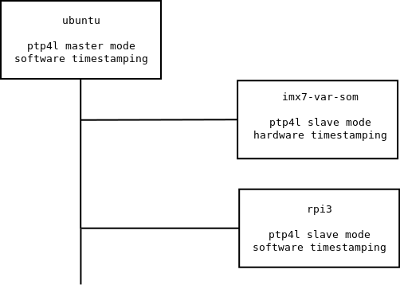
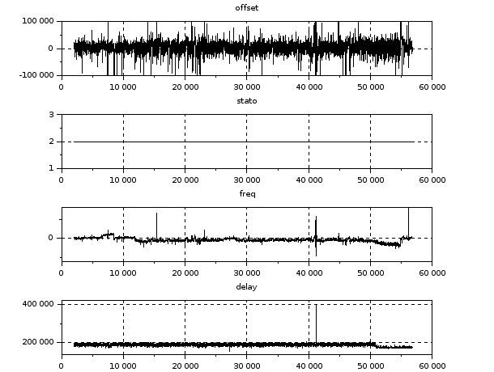
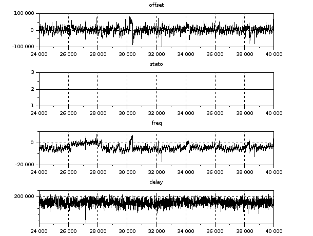
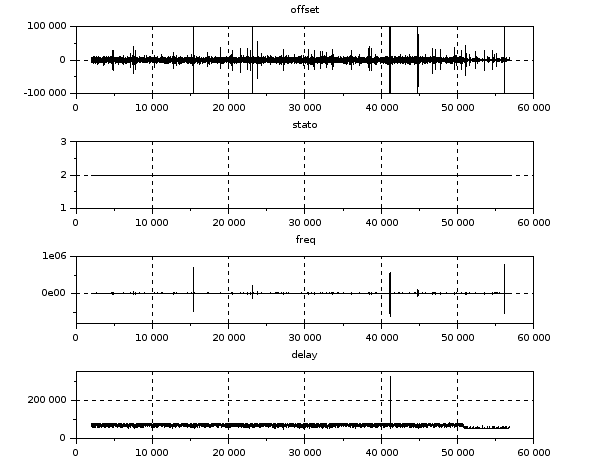
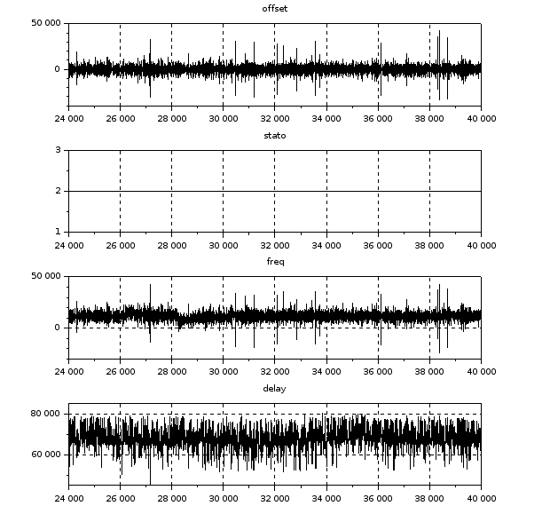

# PTP performances

This document describes results in timing synchronization performance on a
setup with two ptp slaves and a ptp master. Data were collected from the ptp4l
slave algorithm internal metrics and log files and therefore graphed.

For this measurement campaign two different slaves were used. The main
difference between them is the availability of hardware timestamping on the
ethernet phy:
* RaspberryPi3 (software only timestamp)
* Variscite imx7-var-som board (hardware timestamp enabled)

The graphs below represent, on a per second base, the following informations:

* The master offset value tracks the measured offset from the master (in
nanoseconds).
* States of the clock servo: s0 is unlocked, s1 is clock step, and s2 is
locked.
* The freq value represents the frequency adjustment of the clock (in parts per
billion, ppb).
* The path delay value represents the estimated delay of the synchronization
messages sent from the master (in nanoseconds).

## Test 1: PC as ptp4l master, rpi3 and imx7-var-som as ptp4l slaves

### testbench

The below pictures show the graph of the output data of ptp4l of 15 hours run.

### RaspberryPi3

Calculated offsets:

| rms | min | max |
| --- | --- | --- |
| 21.5us | -448us | 797us |

### RaspberryPi3 (4 hours focus)

Calculated offsets:

| rms | min | max |
| --- | --- | --- |
| 16.5us | -99us | 84us |

### imx7

Calculated offsets:

| rms | min | max |
| --- | --- | --- |
| 12.3us |-790us |790us |

### imx7 (4 hours focus)

Calculated offsets:

| rms | min | max |
| --- | --- | --- |
| 3.2us | -34us | 43us |

